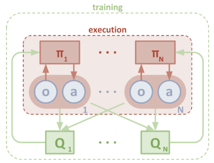
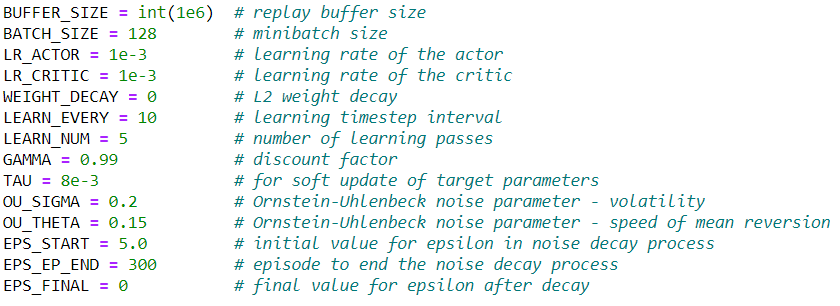
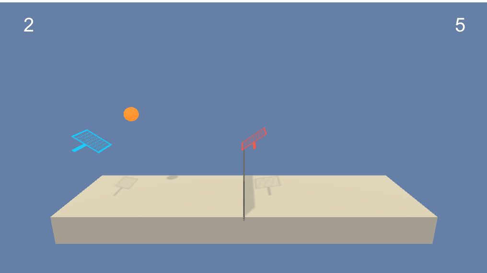
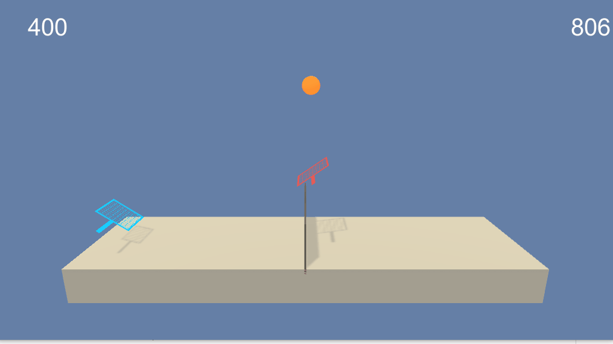

# Project 3 - Tennis Environment with Multiple Agents - Report

### Introduction

In this environment, two agents control rackets to bounce a ball over a net. If an agent hits the ball over the net, it receives a reward of +0.1. If an agent lets a ball hit the ground or hits the ball out of bounds, it receives a reward of -0.01. Thus, the goal of each agent is to keep the ball in play.

The observation space consists of 8 variables corresponding to the position and velocity of the ball and racket. Each agent receives its own, local observation. Two continuous actions are available, corresponding to movement toward (or away from) the net, and jumping.

The task is episodic, and in order to solve the environment, your agents must get an average score of +0.5 (over 100 consecutive episodes, after taking the maximum over both agents). Specifically,

•After each episode, we add up the rewards that each agent received (without discounting), to get a score for each agent. This yields 2 (potentially different) scores. We then take the maximum of these 2 scores.
•This yields a single score for each episode.

The environment is considered solved, when the average (over 100 episodes) of those scores is at least +0.5.

### Algorithm

To solve this challenge, I utilized the Multi-Agent Deep Deterministic Policy Gradient (MADDPG) algorithm. I did extensive research on multi-agent reinforcement algorithms and narrowed it down to this MADDPG and the PPO algorithm used by OpenAI for their DOTA2 project. I went with MADDPG because it’s simpler and I could adapt code from previous Udacity projects to start prototyping quickly. 

MADDPG is adapted from the DDPG algorithm specifically for multi-agent scenarios. As discussed in this paper, it uses a decentralized actor (each agent has its own policy-based actor network) and a centralized critic (each agent has their own value-based critic network that are interconnected). This allows agents to take actions with their actor NN using a policy-based approach, estimating its optimal policy and maximizing its reward via gradient ascent.  The critic NN is a value-based approach that estimates future cumulative rewards of different action/state pairs, which receives as inputs the actions/states from BOTH agents. 

Here's a diagram that depicts the flow of this architecture

To explore the action space, the Ornstein-Uhlenbeck noise function is used. This is like the epsilon-greedy function we’ve used in previous projects, but with the added benefit of time correlation. In other words, the noise added at each timestep is correlated with previous noise inputs, so the actions tend to stay in the same direction for longer periods of time leading to more ‘continuous’ or smooth actions through space. 

A centralized replay buffer is used to enable both agents to learn from each other’s experiences. Samples are collected randomly from the buffer for each learning step. 

The Neural Networks implemented consist of the following;
•Actor network – 3 fully connected linear layers. Fc1 is 256 units, fc2 is 128 units, using RELU activation, with fc3 using the tanh activation (maps states to actions). 
•Critic Network – 3 fully connected linear layers. Fc1 is 256 units, fc2 is 128 units, using RELU activation, with fc3 outputting a single value with no activation (maps state/action pair to a Qvalue).

The implementation of this MADDPG algorithm leverages and adapts code from the previous Udacity lessons on policy-based methods and actor-critic methods. 

### Hyperparameters

Most of the hyperparameters used in this model were the recommendations from experts in various papers and mentors in the knowledge section of this course. I started with batch_size of 64 and buffer size of int(1e5), but decided to try increasing these and found the learning speed improved about 20%. All the other settings worked effectively without too much tweaking (surprisingly). 

Final Hyperparameter settings for my implementation

### Summary of Results

The best training run resulted in the following;

Environment solved in 886 episodes!                 
Moving Average: 0.503 (over past 100 episodes)

The best moving average score achieved was 1.348 at episode 1130. 

Untrained Agents

Trained Agents

### Potential things to try in the future

One thing I noticed in training this model through various iterations, is that it could be relatively unstable. Small tweaks to hyperparameters could cause the model to diverge and in some cases never recover. 

A modification that could improve stability would be Prioritized Experience Replay, which enables the agents to learn from important experiences more frequently. However, in my research of other students trying this feature, they found that it did not help improve their performance so I held off on adding it for the time being...something to experiment with in the future. 

I'm also interested in trying the PPO algorithm used by OpenAI for their DOTA2 model. They have achieved an incredible benchmark with that model defeating professional DOTA2 players, and I'm particularly interested in this because I play the game myself and understand the complexities involved - it's truly incredible that a DRL algorithm has achieved that level of success in that game - so intend to dig deeper into the papers associated with that work. 

I plan on building out the Soccer challenge next, in which I will build a model using this MADDPG architecture, and a parallel model using the PPO architecture from the DOTA2 project, and compare the performance of the two. This is an ambitious project for me given my mediocre programming skills but a good next step in the learning process. 

